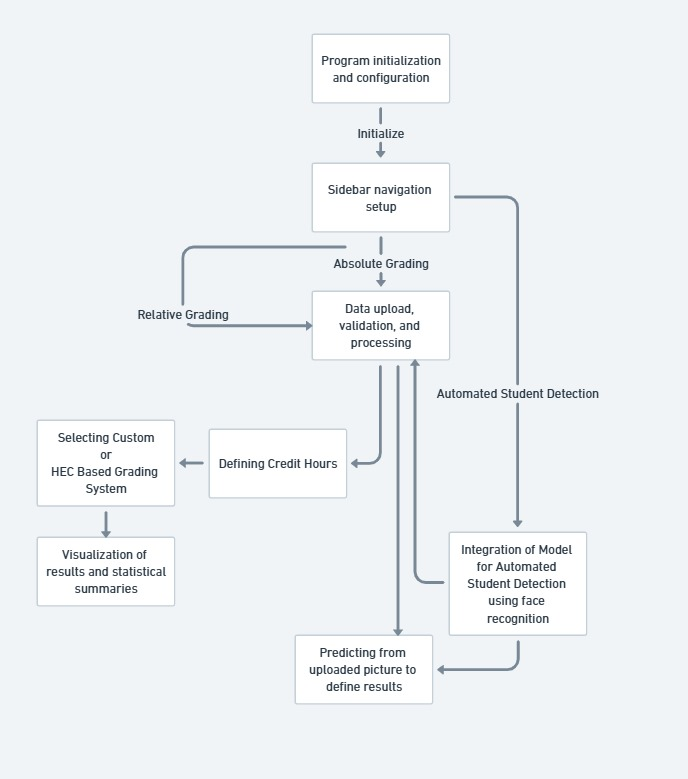

# 🎓 Academic Grading System with Face Recognition


A complete academic grading system that combines facial recognition technology with comprehensive grading methodologies. The system supports both HEC based absolute and relative grading approaches, moreover with an option to set custom threshold as per any standard grading policy in both absolute and relative grading thus providing detailed analytics and visualizations for academic performance assessment.

## 📑 Table of Contents

1. [Features](#-features)
2. [System Architecture](#-system-architecture)
3. [Grading Methodologies](#-grading-methodologies)
4. [Usage Guide](#-usage-guide)
5. [Troubleshooting](#-troubleshooting)
6. [Contributing](#-contributing)

## 🌟 Features

### Core Components

| Feature | Description | Implementation |
|---------|-------------|----------------|
| Face Recognition | Student identification using CNN | `FaceDetector` class with PyTorch |
| Dual Grading | HEC & Relative grading support | `GradingSystem` class |
| Analytics | Statistical analysis & visualization | Pandas, Matplotlib, Seaborn |
| Web Interface | Interactive UI | Streamlit framework |
| Data Management | CSV processing & result export | Pandas DataFrames |

### Visualization Capabilities

| Type | Description | Library Used |
|------|-------------|--------------|
| Grade Distribution | Interactive histograms | Plotly |
| Performance Analysis | Subject-wise metrics | Seaborn |
| GPA Distribution | Comparative analysis | Matplotlib |
| Correlation Maps | Inter-subject relationships | Seaborn |

## 🏗 System Architecture

### Component Structure

### Core Classes

#### Face Detection System

#### Grading System

## 📊 Grading Methodologies

### HEC Standard Grading

| Grade | Score Range | Grade Points | Description |
|-------|-------------|--------------|-------------|
| A     | 85-100     | 4.00         | Outstanding |
| A-    | 80-84      | 3.66         | Excellent   |
| B+    | 75-79      | 3.33         | Very Good   |
| B     | 71-74      | 3.00         | Good        |
| B-    | 68-70      | 2.66         | Above Average |
| C+    | 64-67      | 2.33         | Average     |
| C     | 61-63      | 2.00         | Satisfactory |
| C-    | 58-60      | 1.66         | Pass        |
| D+    | 54-57      | 1.30         | Marginal    |
| D     | 50-53      | 1.00         | Minimal Pass |
| F     | 0-49       | 0.00         | Fail        |

### Relative Grading

| Grade | Standard Deviation Range | Description |
|-------|-------------------------|-------------|
| A     | > 2.0σ                 | Top 2.5%    |
| B+    | 1.5σ to 2.0σ           | Next 7%     |
| B     | 1.0σ to 1.5σ           | Next 12%    |
| B-    | 0.5σ to 1.0σ           | Next 17%    |
| C+    | 0.0σ to 0.5σ           | Next 20%    |
| C     | -0.5σ to 0.0σ          | Next 20%    |
| C-    | -1.0σ to -0.5σ         | Next 17%    |
| D     | < -1.0σ                | Bottom 5%   |

#### Option to set custom Thresholds also available in both grading methodologies!

## 📘 Usage Guide
### Starting the Application


### Data Format Requirements

#### Student Data CSV Format

| Column | Type | Description | Example |
|--------|------|-------------|---------|
| id | int | Student ID | 12345 |
| first_name | str | First name | John |
| last_name | str | Last name | Doe |
| math_score | float | Mathematics score | 85.5 |
| physics_score | float | Physics score | 78.0 |
| ... | ... | ... | ... |

### Face Recognition Setup

1. Prepare student images:

   data/```
   
   ├── train/
   │   ├── student1/
   │   │   ├── img1.jpg
   │   │   └── img2.jpg
   │   └── student2/
   │       ├── img1.jpg
   │       └── img2.jpg
   └── test/
       └── ...


2. Train the model:
 

## ❗ Troubleshooting

| Issue | Possible Cause | Solution |
|-------|---------------|----------|
| Face Detection Fails | Poor image quality | Ensure good lighting and resolution |
| Low Recognition Accuracy | Insufficient training data | Add more student images |
| Grading Error | Invalid CSV format | Check data format requirements |
| CUDA Error | GPU compatibility | Update CUDA drivers |

## 🤝 Contributing

### Development Setup

1. Fork the repository.
2. Create feature branch and add onto the project.

## 📞 Support

- Documentation: [Click here to view!](Project_Report_2023428)
- Email: harris.giki@gmail.com
